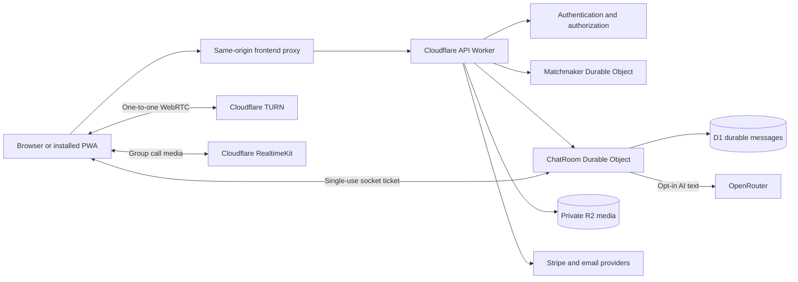

# Elsewhere architecture and launch research

Elsewhere combines guest-first stranger matching with a persistent social profile. The recommended foundation is Cloudflare Workers for APIs, Durable Objects for serialized chat and matching, D1 for durable records, private R2 for attachments, TURN for one-to-one calls, and RealtimeKit for group calls. This keeps operational ownership largely within one platform while separating text reliability from media transport. These are architectural recommendations; service availability, rankings, and freedom from defects are not guarantees.

## Product and interaction design

Starting a conversation should require no email address or purchase. A guest receives a generated username and the same privacy controls as an account holder. Account creation becomes useful when someone wants cross-device access, verified recovery, or a subscription. Better Auth supports anonymous sessions and account linking, which makes this progression possible without treating the guest profile as a disposable demo. The implementation preserves an existing guest profile when a new verified account is linked. Signing into a different existing account opens that account's profile. [Better Auth anonymous authentication](https://better-auth.com/docs/plugins/anonymous)

The app separates Meet, Rooms, Friends, Recent, and Settings. Desktop uses a persistent sidebar and spacious conversation area; phones use bottom navigation, full-height chat, and sheets for secondary controls. Text inputs remain large enough to avoid mobile zoom behavior, safe-area padding accommodates device insets, and controls use semantic buttons, dialogs, tabs, labels, and keyboard focus. Both themes use the same information hierarchy. Browser checks cover widths of 320, 390, 768, 1024, and 1440 pixels; actual hardware remains a separate validation step.

Matching preferences distinguish a preference from a guarantee. When interest matching is enabled, both sides' current waiting rules must be satisfied. Five, ten, and thirty seconds permit broader matching after that duration; Forever never relaxes the shared-interest requirement. Gender preferences are mutual and based on profile declarations, not identity verification. Priority changes queue ordering, not the existence of a suitable person. The interface does not invent online counts or pretend that an empty queue has found someone.

AI companions are opt-in, visibly labeled, and available in text mode only. Natural, concise conversation is compatible with disclosure. Human-only matching is the default, and human conversations do not go to an LLM provider. Persona prompts establish conversational tone without fabricating a human identity, location, or offline life. This approach preserves informed choice and avoids relying on deceptive impersonation as a retention mechanism.

## Realtime architecture

Durable Objects provide a natural ownership boundary for a conversation: one object serializes competing message, game, and leave operations. WebSocket hibernation permits idle connections without keeping application JavaScript continually active; durable state must still be stored explicitly and socket attachments must carry the context needed after resumption. The implementation uses D1 for saved messages and socket attachments for authenticated membership context. [Cloudflare WebSocket guidance](https://developers.cloudflare.com/durable-objects/best-practices/websockets/), [Durable Object state](https://developers.cloudflare.com/durable-objects/api/state/)

Text delivery is designed around persistence before acknowledgement. Each client message has a unique ID, so a retry can return the original saved message rather than duplicate it. Server sequences order durable history; WebSocket delivery reduces latency, and HTTP catch-up retrieves gaps after interruption. The client distinguishes sending, sent, and failed states. A local unsent draft belongs to one profile and one conversation, preventing it from appearing in another chat after navigation.

No internet application can prevent every dropped connection. A suspended mobile browser, lost network, expired session, provider outage, or router change can interrupt transport. The useful requirement is bounded recovery with accurate status and no silent data loss. The client uses heartbeat detection, jittered reconnect delays, online/offline events, catch-up polling, and explicit retry controls. A saved message remains recoverable even when its immediate acknowledgement is lost.

| Failure or race                         | Implemented handling                                             | Remaining operational validation                       |
| --------------------------------------- | ---------------------------------------------------------------- | ------------------------------------------------------ |
| Duplicate send or retry                 | Unique message ID; same saved record returned                    | Sustained retry storms and regional outage drills      |
| Socket interruption                     | Fresh one-use ticket, backoff, durable catch-up                  | Physical mobile background/resume and captive portals  |
| Two simultaneous game moves             | Serialized processing and expected revision                      | Large active-room concurrency                          |
| Matching cancellation during assignment | Matchmaker resolves assignment and ends the created match        | Load tests with many simultaneous join/cancel requests |
| Unfriend or block                       | Server checks relationship/access; socket session checks         | Operational abuse-response turnaround                  |
| Delayed subscription cancellation       | Retrieve current Stripe state; recompute best active entitlement | Live checkout/SCA and parallel purchase behavior       |
| LLM timeout                             | User message remains saved; explicit reply error                 | Provider-specific rate limits and content evaluation   |

The current matchmaker is intentionally a single serialized queue, with a bounded candidate scan. It is understandable and testable for an early preview, but it is not evidence of global-scale throughput. Before a large launch, benchmark real join/cancel traffic and introduce compatible regional or language partitions only with a plan for low-population pools and cross-partition matching. D1 indexes and query costs should be measured under realistic message and membership volumes.

## Voice and video choice

| Option                         | Strength                                                  | Constraint                                                       | Decision                                        |
| ------------------------------ | --------------------------------------------------------- | ---------------------------------------------------------------- | ----------------------------------------------- |
| Direct peer-to-peer WebRTC     | Minimal media infrastructure in favorable networks        | Connectivity varies; peers may learn network addresses           | Do not use as the privacy default for strangers |
| WebRTC through Cloudflare TURN | Standard browser transport, relay credentials with expiry | Relay bandwidth and connectivity remain operational dependencies | Use for one-to-one calls                        |
| Custom SFU integration         | Flexible control over subscriptions and tracks            | More signaling, lifecycle, and recovery code                     | Keep as a future option                         |
| Cloudflare RealtimeKit         | SDK and meeting/participant primitives for group calls    | Vendor SDK and private runtime token required                    | Use for rooms                                   |

TURN relays WebRTC traffic when direct connectivity is unavailable or deliberately disallowed. The application requests short-lived credentials from its server and sets relay-only ICE policy, so a stranger does not receive the other participant's direct network candidate through this app. Media access begins only after the participant clicks Join; leaving or changing conversations stops local tracks. This is transport privacy, not a claim that Cloudflare cannot process connection metadata. [Cloudflare TURN](https://developers.cloudflare.com/realtime/turn/), [Credential generation](https://developers.cloudflare.com/realtime/turn/generate-credentials/)

For groups, RealtimeKit provides SDK initialization, meetings, participant authorization, and media state. It avoids implementing a full group SFU subscription layer within the chat product. Stable participant IDs should be opaque internal IDs, and permissions should come from a least-privilege preset. The provisioned participant preset disables recording, livestreaming, arbitrary display-name edits, provider chat/file transfer, plugins, and screen sharing. Text and attachments stay in Elsewhere's own authorization path. [RealtimeKit overview](https://developers.cloudflare.com/realtime/realtimekit/), [Quickstart](https://developers.cloudflare.com/realtime/realtimekit/quickstart/), [FAQ](https://developers.cloudflare.com/realtime/realtimekit/faq/)

An SFU can become useful when custom group-media routing is a differentiator, but it adds responsibility for track subscriptions, reconnection, cleanup, and participant state. RealtimeKit is the preferred initial tradeoff here; this is an engineering judgment, not proof that it is universally fastest or cheapest. No paid capacity or spend commitment was assumed from marketing descriptions. [Cloudflare SFU](https://developers.cloudflare.com/realtime/sfu/)

## Accounts, privacy, and authorization

Email sign-up requires verification before paid checkout. Password reset links go through a server-side email provider. Google OAuth credentials remain on the server, and the callback origin must match the actual deployed domain. D1's SQLite adapter is configured without unsupported transactional behavior in the authentication layer. Simulated-provider tests exercise the full email verification transition, including invalidation of the previous guest session. [Email/password authentication](https://better-auth.com/docs/authentication/email-password), [Drizzle adapter](https://better-auth.com/docs/adapters/drizzle)

Private routes check membership or ownership on every request. A profile ID or conversation ID is not authorization. Media access requires both ownership/membership and applicable policy checks; public R2 hosting is disabled. File signatures, byte limits, content types, and paid entitlements are verified on the server. Default image blur is a user control rather than content moderation. Blocking hides blocked participants' room messages and prevents private interaction while allowing unrelated room participants to continue speaking.

Text is encrypted in transit but stored in readable form for delivery and moderation. It must not be marketed as end-to-end encrypted or invisible to the operator. Reports retain a bounded message snapshot so an investigation is possible after a conversation ends. Push payloads omit sender names and message contents. Guest sessions can be lost when cookies are cleared; verified accounts offer a recovery path.

A public privacy policy must describe the actual operating entity, collection purposes, service providers, overseas processing, retention, rights, and a functioning contact path. Australian Privacy Act coverage depends on the entity and circumstances; the app cannot infer exemption or coverage from its size alone. The preview policy explicitly identifies its preview status. Final wording, age-assurance obligations, moderation procedures, and launch jurisdictions require operator decisions and legal review before public availability. [OAIC privacy policies](https://www.oaic.gov.au/privacy/your-privacy-rights/your-personal-information/what-is-a-privacy-policy), [Australian Privacy Principles guidance](https://www.oaic.gov.au/privacy/australian-privacy-principles/australian-privacy-principles-guidelines)

## Memberships and provider boundaries

The proposed display prices are USD 5/month for Basic and USD 10/month for Plus. Annual prices of USD 48 and USD 96 are exactly 20% below twelve monthly payments. These are product choices, not researched willingness-to-pay estimates. Free has five interest slots; Basic has thirteen; Plus has twenty. History limits are five, fifteen, and twenty-five entries respectively. Paid entitlements are enforced in the API rather than merely hiding buttons.

Stripe is authoritative for subscription state. A successful redirect is not proof of payment. The server verifies webhook signatures, ignores replayed events, retrieves current subscription data, and recalculates the profile's active entitlement. Existing members use the billing portal to manage their plan. Provider tests cover a delayed cancellation from an older subscription arriving after a newer Plus subscription. Live payment methods, tax, refunds, SCA, and customer communication need validation with the actual Stripe account and business configuration. [Stripe subscription webhooks](https://docs.stripe.com/billing/subscriptions/webhooks)

A Durable Object per profile serializes checkout and account deletion. The stored attempt preserves Stripe request parameters across retries and restarts. Repeated tabs reuse checkout; plan changes expire the open session before replacing it. Current Stripe subscription status prevents duplicate purchases during webhook delays. Simulated provider tests exercise concurrency, lost responses, restart recovery, expiration, and payment winning the race against a plan change. The design uses Stripe's idempotency and session expiration guarantees, while live end-to-end verification remains required. [Stripe idempotent requests](https://docs.stripe.com/api/idempotent_requests), [Checkout expiration](https://docs.stripe.com/api/checkout/sessions/expire)

OpenRouter receives a bounded recent text history only in disclosed AI conversations. Calls and human-only messages are not routed there. API credentials remain in Worker secrets; model choice is configurable, replies have token/time limits, requests are rate-limited, and processing asks for providers that deny data collection. Availability still depends on the selected model and provider policies. Evaluate conversational quality and safety with representative interactions before enabling real users; a persona prompt alone is not a moderation system. [OpenRouter API overview](https://openrouter.ai/docs/api_reference/overview)

## Search and advertising

The public landing and policy pages use descriptive titles, canonical URLs, server-rendered content, an XML sitemap, and a crawlable navigation structure. Private conversations, settings, and moderation are excluded from indexing. This creates a technically sound foundation for discovery, but ranking also depends on original content, reputation, competition, performance, and search-engine judgment. Thin automatically generated pages for every interest would not establish useful search value. [Google JavaScript SEO guidance](https://developers.google.com/search/docs/crawling-indexing/javascript/javascript-seo-basics)

Advertising belongs on deliberately designed public surfaces with room reserved for the placement, never inside private chat content, disguised as a message, or next to controls in a way that encourages accidental clicks. This is the recommended design policy. Google's publisher rules place responsibility for user-generated content on the publisher, so unrestricted live chat is a particularly poor default ad surface. The preview loads no ad or analytics trackers. An approved publisher account, applicable consent management, policy review, and measured layout impact are required before activation. [AdSense user-generated content](https://support.google.com/adsense/answer/1355699?hl=en), [Ad placement policies](https://support.google.com/adsense/answer/1346295?hl=en)

Plus reserves an ad-free entitlement. That entitlement must be checked before any future ad script loads, not just before rendering a slot. Advertising revenue should not be assumed in capacity planning before approval and observed traffic. Search position, fill rate, CPM, and approval cannot be promised from code quality alone.

## Release evidence and next decisions

The automated checks include 39 domain and relay tests, 63 API integration assertions against a fresh local Cloudflare runtime, three provider/authorization tests, responsive browser checks, and a real two-browser text/game flow. The latter deliberately fails a send, reloads the page, retries it, interrupts connectivity, and verifies catch-up. A separate browser test uses synthetic camera/microphone input with real, short-lived Cloudflare TURN credentials; both browsers receive video over verified relay candidates, and microphone/hangup controls pass. This demonstrates concrete behavior under those conditions; it does not substitute for a penetration test, browser/device matrix, soak test, or production traffic.

Release readiness should be judged by observable measures: successful durable sends, duplicate rate, time to recover missing messages, queue latency by matching preference, call connection success by network type, moderator backlog, and provider spend. Establish targets from a controlled beta rather than publishing unsupported availability percentages. Keep runtime errors free of message contents and credentials.

The immediate activation dependencies are the final domain, Google OAuth configuration, an authenticated email sender, Stripe products/secrets/webhook, OpenRouter credentials, a private RealtimeKit runtime token, and an operator moderator account. The repository connection exists on Cloudflare; a dedicated deployment credential is needed for an automatic build trigger. After these are configured, run provider smoke tests and complete legal/moderation operations before opening access beyond the owner preview.

Sources were reviewed against the implementation during September 2026. Product capabilities and provider APIs can change; verify the linked primary documentation when changing dependencies or enabling a new jurisdiction or payment method.
